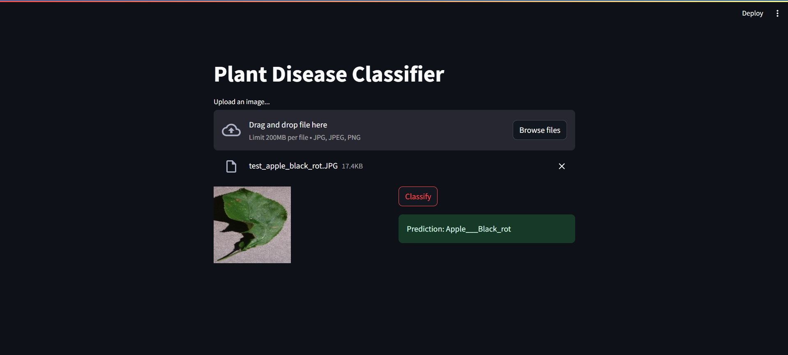

# Plant Disease Classifier - TensorFlow & Streamlit App

Welcome to the Plant Disease Classifier repository! This project is an end-to-end Deep Learning application that classifies plant diseases using TensorFlow and Streamlit. The web app successfully identifies whether a plant has any disease and, if so, which one, or if it's healthy. The project was created by following the "DL Project 7: Plant Disease Prediction with CNN - End to End Deep Learning Project | Docker" tutorial by Clear Code on Siddhardhan's YouTube channel.

## Overview

The Plant Disease Classifier is a powerful tool for identifying diseases in plants. Leveraging the capabilities of Convolutional Neural Networks (CNNs) with TensorFlow and presented through a Streamlit web app, this project provides a user-friendly interface for plant health diagnosis.

## Features

- **Disease Classification:** Accurately classifies plant diseases using a trained CNN model.

- **Healthy Plant Check:** Identifies and confirms if a plant is healthy.

- **Streamlit Web App:** The user interface is developed using Streamlit, providing an interactive and intuitive experience.

- **End-to-End Deep Learning:** Demonstrates the process of building, training, and deploying a deep learning model for practical use.



## Getting Started

To run the Plant Disease Classifier locally, follow these steps:

1. **Clone the Repository:** `git clone https://github.com/rohan-4761/plant-disease-classifier.git`

2. **Navigate to Project Directory:** `cd plant-disease-classifier`

3. **Install Dependencies:** Make sure you have the necessary Python packages installed. You can install them using:

   ```bash
   pip install -r requirements.txt
   ```

4. **Run the Streamlit App:** Start the web app using:

   ```bash
   streamlit run main.py
   ```

5. **Open in Your Browser:** Open your web browser and navigate to the URL provided by Streamlit (usually `http://localhost:8501`).

6. **Upload Plant Images:** Use the web app to upload images of plants and receive instant disease classification results.

## Credits

This project was developed by following the "DL Project 7: Plant Disease Prediction with CNN - End to End Deep Learning Project | Docker" tutorial by Clear Code on Siddhardhan's YouTube channel. Special thanks to Clear Code for the insightful tutorial.

## License

This project is licensed under the MIT License. For more information, view the [LICENSE](LICENSE) file.

---

Experience the power of deep learning in plant disease classification with the Plant Disease Classifier. Whether you're a botanist, farmer, or enthusiast, this tool makes plant health assessment accessible and efficient. Explore, contribute, and stay green!